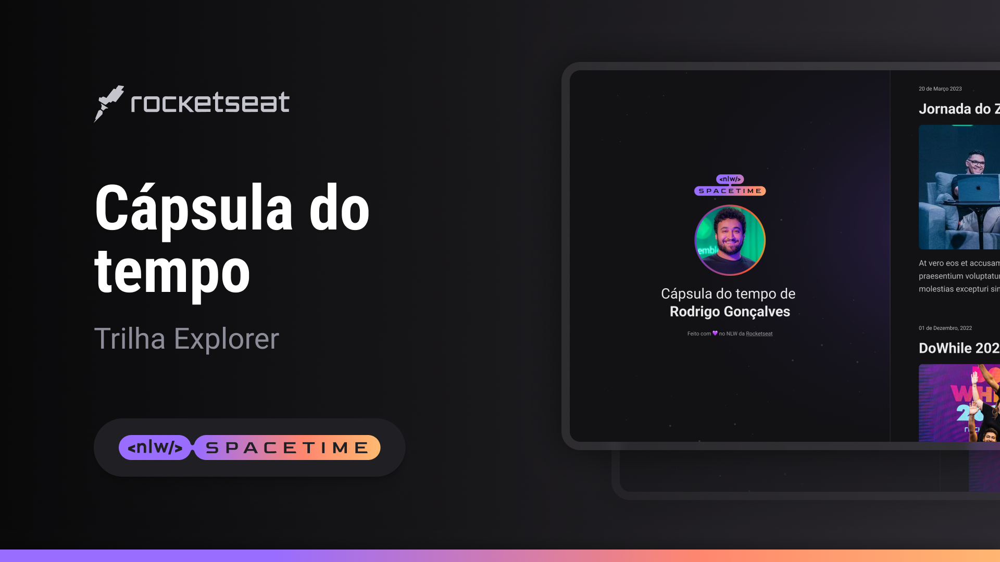

## Projeto 💻
Esse é um projeto Web Responsivo de uma cápsula do tempo para exibir memórias em uma linha do tempo.

## 🚀 Tecnologias
Esse projeto foi desenvolvido durante o NLA da Rocketseat com as seguintes tecnologias:

- HTML
- CSS
- Git e Github

##  Layout
Você pode visualizar o layout do projeto através [desse link](https://www.figma.com/file/JnRYXVe86tJePdFGsaRIVv/C%C3%A1psula-do-tempo-%E2%80%A2-Trilha-Explorer?type=design&node-id=306%3A3&t=4xw6UX7wYqoLbvOH-1).
É necessário ter uma conta no [Figma](https://figma.com)
